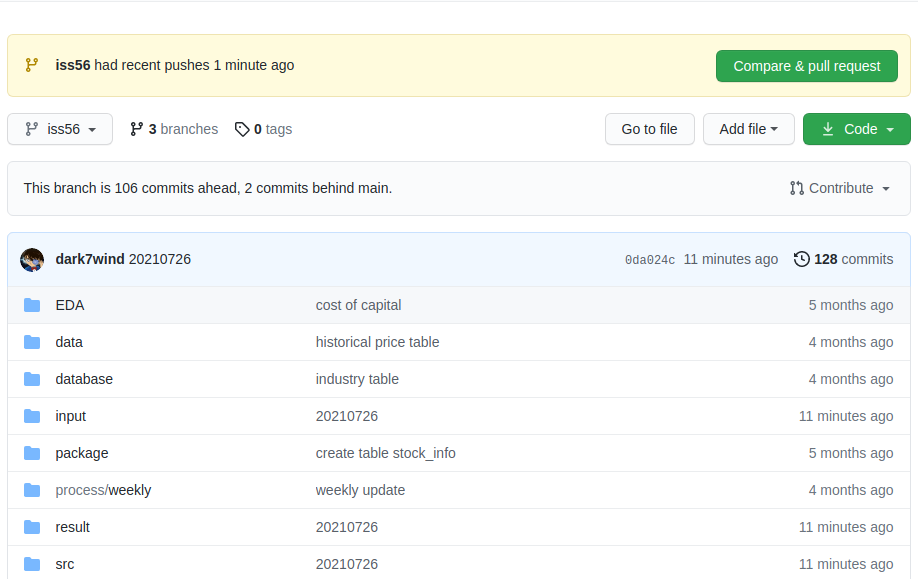
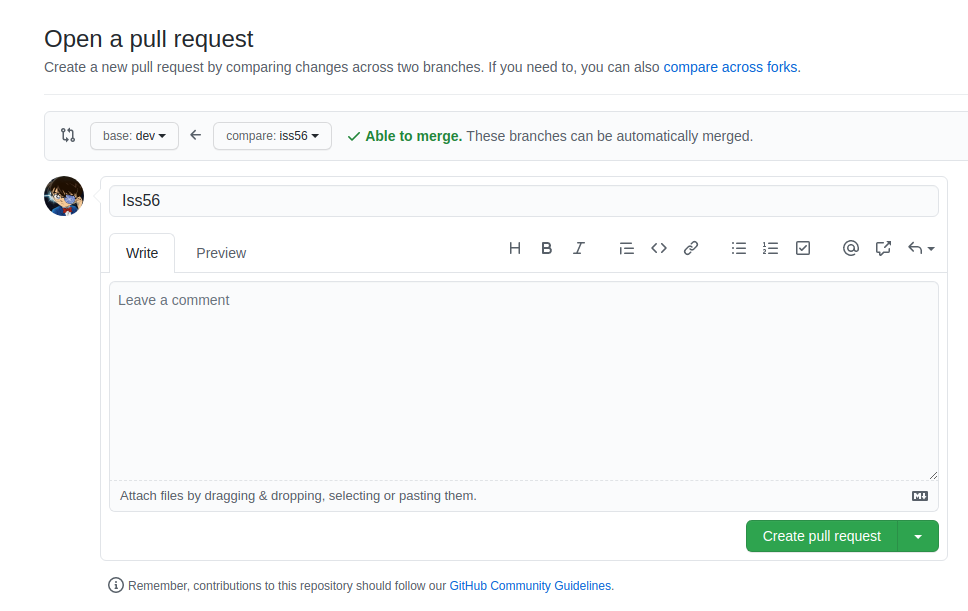
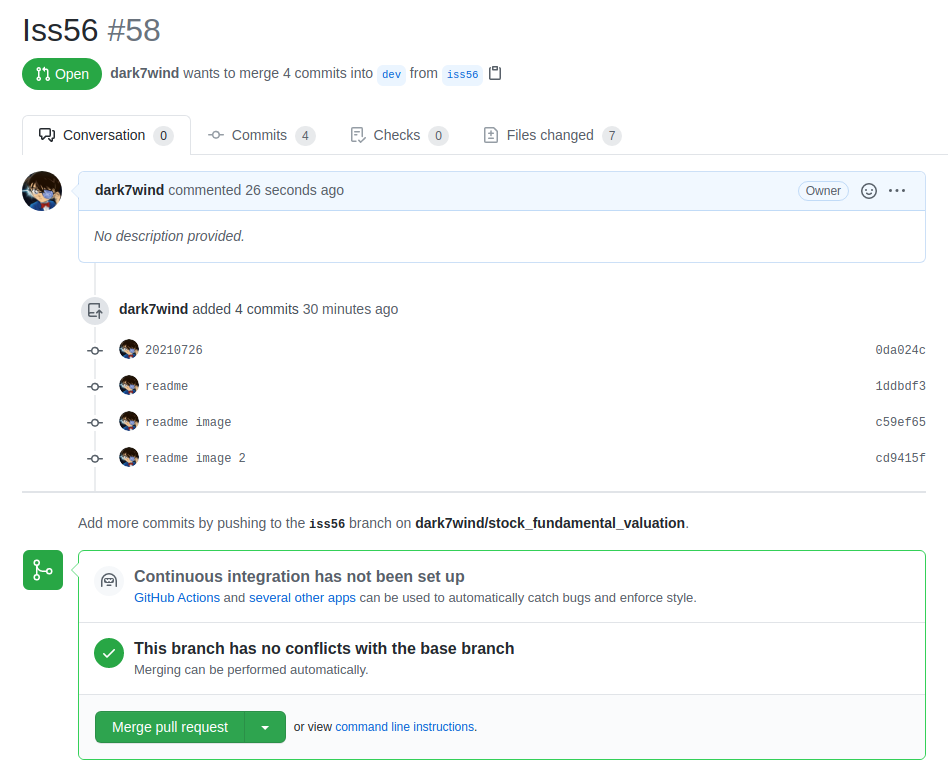

# stock_fundamental_valuation
fundamental valuation

# Database: securities_database
1. **balance_sheet**
2. **cash_flow** 
3. **income_statement**
4. **income_statement_TTM**  
The reason to add this table is that there only exists 4 quarterly income statement 
report. Thus we cannot use the 'trailling 12 months' to calculate the up-to-date 
financial data. 

5. **stock_info**
6. **stock_statistics**
7. **analysis_info_revenue**

# Update database table

# Multiple stocks evaluation

# Detail stock evaluation

# Process
1. Weekly update
* Wednesday update analysis info revenue 
* Wednesday update stock statistics
* Thursday update income_statement_TTM
    * run process/weekly/weekly_update_income_statement_TTM.py
* Friday update balance sheet
    * run process/weekly/weekly_update_balance_sheet.py
* Friday update cash flow
    * run process/weekly/weekly_update_cash_flow.py
* Friday update income_statement.py
    * run process/weekly/weekly_update_income_statement.py
* Friday update historical_price

2. Monthly update
* update stock info

3. Yearly update
* update industry 

# Git
1. Create issue xx at www.github.com
2. Create a branch in local repository  
`git checkout -b issxx`
3. When the issue is resolved, push the codes to the remote repository in www.github.com
4. In Github, click `Compare & pull request`, see example below:

5. In Github, click `Create pull request`, base: `dev`, compare: `[branch]`

6. Click `merge pull request`

7. Delete branch in Github
8. Close issue in Github
9. At local, switch to `dev` branch: `git checkout dev`
10. At local, pull from dev in Github: `git pull`
11. At local, delete the branch: `git branch -d iss56`
12. At local, create new branch according to the name of issue: `git checkout -b iss58`

# Git (release / tag)
Step 1: check out the branch where you want to create tag
Git checkout <branch>

Step 2: create tag with some name
Git tag <tag name> 
Example: git tag v1.0
Tag with annotate
Example: git tag -a v1.1 -m “tag for release ver 1.1”

Step 3: display tags
Git tag
Git show v1.0
Git tag -l “v1.*”

Step 4: push tag to remote
Git push origin v1.0
Git push origin --tags
Git push --tags
(to push all tags at once)

Step 5: delete tags (if required)
To delete tags from local:
Git tag -d v1.0
Git tag --delete v1.0

To delete tags from remote:
Git push origin -d v1.0
Git push origin --delete v1.0
Git push origin:v1.0

To delete multiple tags at once
Git tag -d v1.0 v1.1 (local)
Git push origin -d v1.0 v1.1 (remote)

How to checkout tags (when required)
We cannot checkout tags in git
We can create a branch from a tag and checkout the branch
Git checkout -b <branch name> <tag name>
Example: git checkout -b ReleaseVer1 v1.0

Can I create a tag from some past commit?
Yes
Git tag <tag name> <reference of commit>
Example: git tag v1.2 5fcdb03

