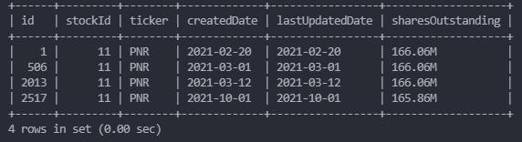

# Database Management

## Database
Database name: `securities_database`

### Tables overview
1. **balance_sheet**
2. **cash_flow** 
3. **income_statement**
4. **income_statement_TTM** (depreciated) 
5. **stock_statistics** 
6. **analysis_info_revenue**
7. **stock_info**
8. **industry**

### Table: balance_sheet
The data is collected from Yahoo Finance via Python package `yahoo_fin`. The table name is `balance_sheet`.

**Action:** Run the `process\weekly\weekly_update_balance_sheet.py`
**Frequency:** weekly

### Table: cash_flow
The data is collected fromm Yahoo Finance via Python package `yahoo_fin`. The table name is `cash_flow`.

**Action:** Run the `process\weekly\weekly_update_cash_flow.py`
**Frequency:** weekly

### Table: income_statement
The data is collected fromm Yahoo Finance via Python package `yahoo_fin`. The table name is `income_statement`.

**Action:** Run the `process\weekly\weekly_update_income_statement.py`
**Frequency:** weekly

### Table: income_statement_TTM (depreciated)
The reason to add this table is that there only exists 4 quarterly income statement report. Thus we cannot use the 'trailling 12 months' to calculate the up-to-date financial data.
**Action:** Run the `process\weekly\old\weekly_update_income_statement_TTM.py`
**Frequency:** weekly

### Table: stock_statistics
The data is collected fromm Yahoo Finance via Python package `yahoo_fin`. The table name is `stock_statistics`.

**Action:** Run the `process\weekly\weekly_update_stock_statistics.py`
**Frequency:** weekly

### Table: analysis_info_revenue
The data is collected fromm Yahoo Finance via Python package `yahoo_fin`. The table name is `analysis_info_revenue`.

**Action:** Run the `process\weekly\weekly_update_analysis_info_revenue.py`
**Frequency:** weekly

### Table: stock_info
This table is built based on the file `indname.xls` from Prof. Damodaran's webiste [Prof. Damodaran's webiste ](https://pages.stern.nyu.edu/~adamodar/) 'data breakdown' --> company lookup --> spreadsheet that includes the listing of industries and the companies in each one

**Action:** Check if the data is updated every six months
**Frequency:** every 6 months

### Table: industry
This table is collecting the the industry specific data, for example `Industry Name`, `Number of firms`, `Annual Average Revenue growth - Last 5 years`, `Pre-tax Operating Margin (Unadjusted)`, `After-tax ROC`, `Average effective tax rate,Unlevered Beta`, `Equity (Levered) Beta`, `Cost of equity`, `Std deviation in stock prices`, `Pre-tax cost of debt`, `Market Debt/Capital`, `Cost of capital,Sales/Capital`, `EV/Sales`, `EV/EBITDA`, `EV/EBIT`, `Price/Book`, `Trailing PE`, `Non-cash WC as % of Revenues`, `Cap Ex as % of Revenues`, `Net Cap Ex as % of Revenues`, `Reinvestment Rate`, `ROE,Dividend Payout Ratio`, `Equity Reinvestment Rate`, `Pre-tax Operating Margin (Lease & R&D adjusted)`

The data souce is Damodaran's every year valution excel sheet

**Action:** Update the data every year from Damodaran's valuation excel sheet
**Frequency:** yearly


## MySQL
### Backup the database
In command terminal, run 
`sudo mysqldump [database name] > dumpfilename.sql` (dumpfilename --> backup_securities_database_20210927
)

### Restore the database
* Step 1: In mysql console, create a database `CREATE DATABASE [database name]`
* Step 2: In terminal, restore the database `sudo mysql -u root -p [database name] < dumpfilename.sql`
note: in windows (if cannot add the MySQL bin path to the windows system path environment), in Command Prompt `cd "c:\Program Files\MySQL\MySQL Server 8.0\bin"` and `mysql -u root -p [database name] < "c:\[dumpfile path]\dumpfilename.sql"`

### Delete Duplicate Records
In the table 'stock_statistics':

need to delete the duplicates on ticker and sharesOutstanding.


MySQL syntax:
```sql
DELETE t1 FROM stock_statistics t1
INNER JOIN stock_statistics t2
    WHERE 
    t1.id < t2.id AND
    t1.ticker = t2.ticker AND
    t1.sharesOutstanding = t2.sharesOutstanding;
```

### Add (Composite) Unique Constraint
#### Show composite unique constraint
```sql
# check how you can create this table
SHOW CREATE TABLE stock_statistics;
```
#### Add composite unique constraint
```sql
ALTER TABLE `stock_statistics` ADD UNIQUE `unique_index_2`(`ticker`, `sharesOutstanding`);
```

