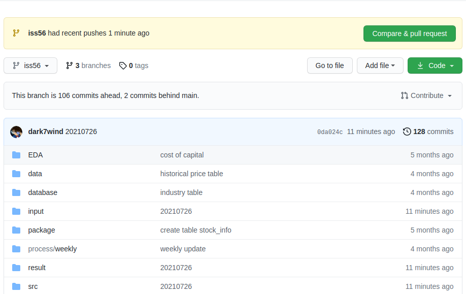
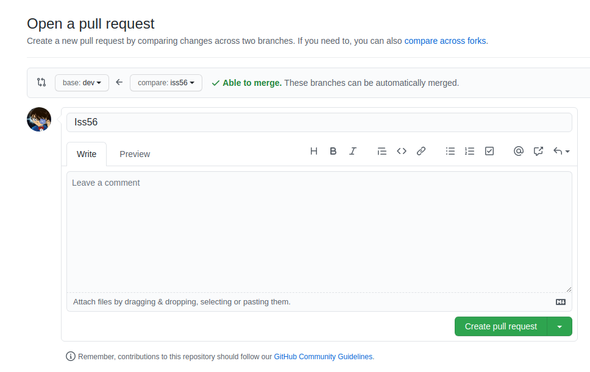
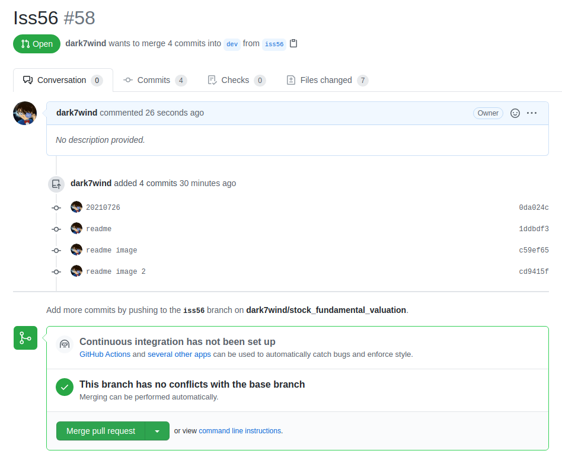

## Modify / Add New Features Process
1. Create issue xx at www.github.com

2. Create a branch in local repository
`git checkout -b issxx`

3. When the issue is resolved, push the codes to the remote repository in www.github.com

4. In Github, click `Compare & pull request`, see example below:

5. In Github, click `Create pull request`, base: `dev`, compare: `[branch]`

6. Click `merge pull request`

7. Delete branch in Github

8. Close issue in Github

9. At local, switch to `dev` branch: `git checkout dev`

10. At local, pull from dev in Github: `git pull`

11. At local, delete the branch: `git branch -d iss56`

12. At local, create new branch according to the name of issue: `git checkout -b iss58`

## Release & Tag
* Step 1: check out the branch where you want to create tag  
    `git checkout <branch>`

* Step 2: create tag with some name  
    `git tag <tag name> `
    Example: `git tag v1.0`
    Tag with annotate, example ("tag for release ver 1.1"): 
    `git tag -a v1.1 -m `
* Step 3: display tags
    `git tag`  
    `git show v1.0  `
    `git tag -l "v1.*"`
* Step 4: push tag to remote
    `git push origin v1.0`
    `git push origin --tags`
    `git push --tags # to push all tags at once`
        

* Step 5: delete tags (if required)
    To delete tags from local:
    `git tag -d v1.0`
    `git tag --delete v1.0`
    To delete tags from remote:
    `git push origin -d v1.0`
    `git push origin --delete v1.0`
    `git push origin:v1.0`
    To delete multiple tags at once
    `git tag -d v1.0 v1.1 #(local)`
    `git push origin -d v1.0 v1.1 #(remote)`

* How to checkout tags (when required)
    We cannot checkout tags in git
    We can create a branch from a tag and checkout the branch
    `git checkout -b <branch name> <tag name>`
    Example: `git checkout -b ReleaseVer1 v1.0`

* Can I create a tag from some past commit?
    Yes
    `git tag <tag name> <reference of commit>`
    Example: `git tag v1.2 5fcdb03`

